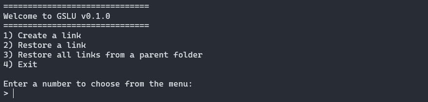

# GSLU - Game Save Linking Utility

This is a utility program that I originally made for myself to help create links for my game saves. The best use I see for it is linking the saves directory to a cloud service like OneDrive or a NAS, to be used for backup and for syncing with other computers.

**This program currently needs to be run as administrator and is only working on Windows.**

## Quick Start

Download the release exe and run it as administrator.

You can add it to your PATH to use it globally with `gslu.exe`.

## Development

Run locally with `go run .` (in a command prompt that runs as administrator).

Build with `go build`.
